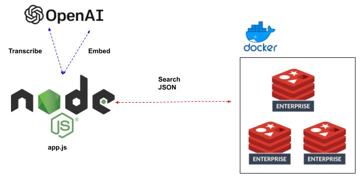
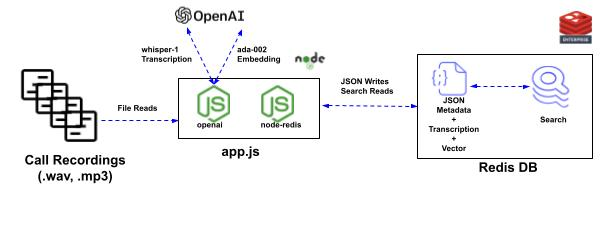
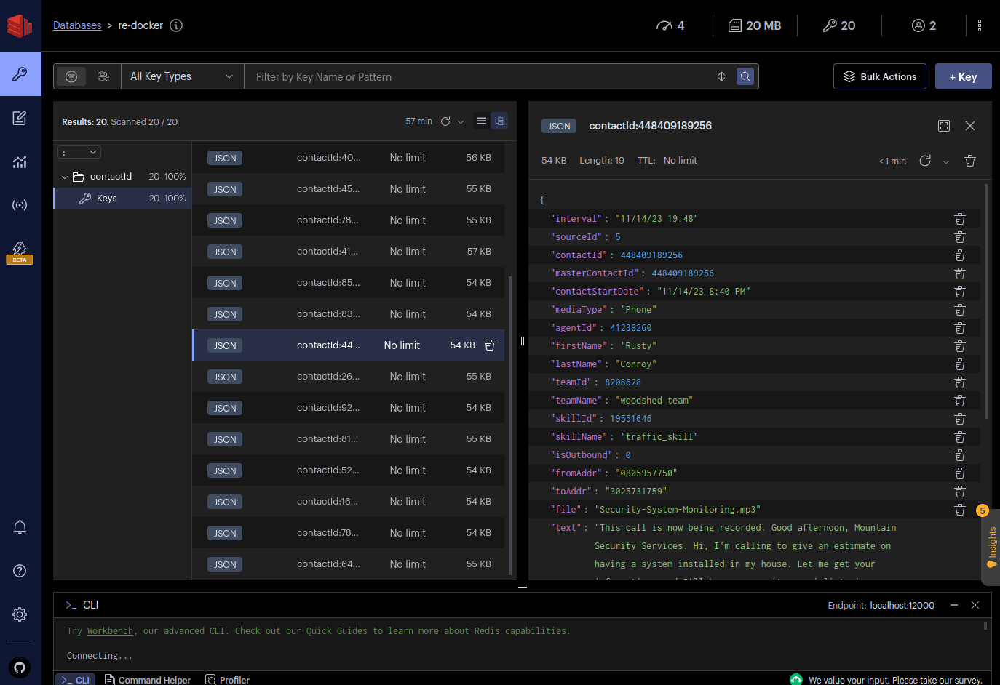

# Redis + Contact Center Demo  

## Contents
1.  [Summary](#summary)
2.  [Architecture-High](#arch-high)
3.  [Data Flow](#dataflow)
4.  [Features](#features)
5.  [Prerequisites](#prerequisites)
6.  [Installation](#installation)
7.  [Start-up](#start)
8.  [Shut-down](#stop)
9.   [Redis Insight](#insight)
10.  [Scenario 1](#scenario1)
11.  [Scenario 2](#scenario2)
12.  [Scenario 3](#scenario3)

## Summary <a name="summary"></a>
This is a Nodejs app that creates synthetic contact center data associated with call recordings.  OpenAI is leveraged to transcribe and vectorize those recordings.  The meta-data, transcripts and vectors are stored in Redis JSON objects.  Those object indexed with Redis Search.  Three example search scenarios are then demonstrated.

## Architecture <a name="arch-high"></a>
  

## Data Flow <a name="dataflow"></a>
  

## Features <a name="features"></a>
- Creates synthetic call records
- Creates transcripts and vectors of sample call recordings
- Stores all the above in Redis as JSON objects
- Demonstrates Redis Search capabilities on those objects 

## Prerequisites <a name="prerequisites"></a>
- Docker
- Node
- npm
- OpenAI API Key

## Installation <a name="installation"></a>
- clone this repo
- npm install
- Rename the .env_template file to .env
- Paste your OpenAI API key in the OPENAI_API_KEY field

## Start-up <a name="start"></a>
```bash
./start.sh
```

## Shut-down <a name="stop"></a>
```bash
./stop.sh
```
## Redis Insight Screenshot <a name="insight"></a>
Screenshot of the meta-data JSON objects
  

## Scenario 1 <a name="scenario1"></a>
Find all the call recordings from agentID 17210096
```bash
Redis exec time: 1.14 ms
Costco.mp3
```

## Scenario 2 <a name="scenario2"></a>
Find all the call recordings whose transcripts had the term "Philadelphia" in them.
```bash
Redis exec time: 0.51 ms
Third-Party-Verification.mp3
```

## Scenario 3 <a name="scenario3"></a>
Find the most relevant recording with a discussion of health insurance
```bash
Redis exec time: 4.43 ms
Hello? Hi, good morning. I'm looking for Charles Kluwe. Yeah, this is Charles. Alright, thank you. So anyway, Charles, this is Billy from Medicare Ally. And I'm just calling you regarding some recent changes made on most medical plans. And this year, it brings new health plans and drug coverage options. And you are eligible to lower down your medication costs. And you can get your own dental, vision, and hearing coverage in a $0 premium or at no cost to you. So I just want to know, Mr. Liu, does your Medicare Parts A and B are currently active this year? Yeah. Okay, great. So aside from Medicare, do you also have your own private advantage plan like from Humana or Blue Cross Blue Shield, AARP? Yeah, Humana. Humana, okay. And also, are you getting some co-pays, deductibles, or even a co-insurance from Humana? Yeah. So how much are you currently spending, sir, with Humana? I'm on about $3, $3 only on the medications, and they pay for everything else. For the medication, that is $3, okay. Alright, so now to make sure that you are receiving these upgraded benefits, and you can save more money on your medical plan together with Humana, I will have one of our licensed Medicare advisors on the other line to discuss to you some policy breakdown review so that you'll be informed and up to date on your Medicare benefits and coverage. And also just to make sure that you are aware of the new changes with supplemental benefits that have taken place, which can provide you those premium benefits, cost-saving plans, lower monthly premiums, and also for the reduction on your Medicare Part B deductibles. Okay? So, Mr. Low, I'll also be needing your date of birth, so when is your birthday? 7-13-56. 30? 7-13-56. Okay, 13. Alright, thank you so much. So, Mr. Low, I want you to stay on the line, and then I will connect you over now to one of our licensed Medicare experts, okay? Alright. Alright, thank you.
```